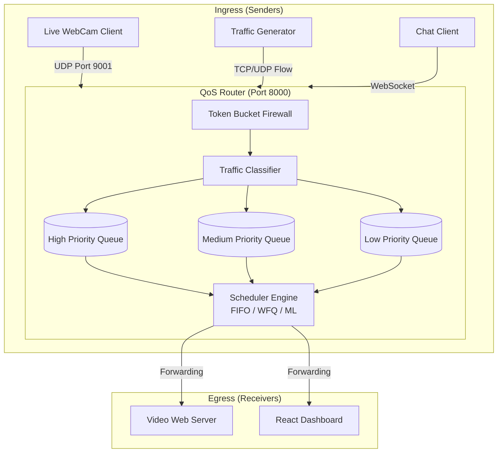
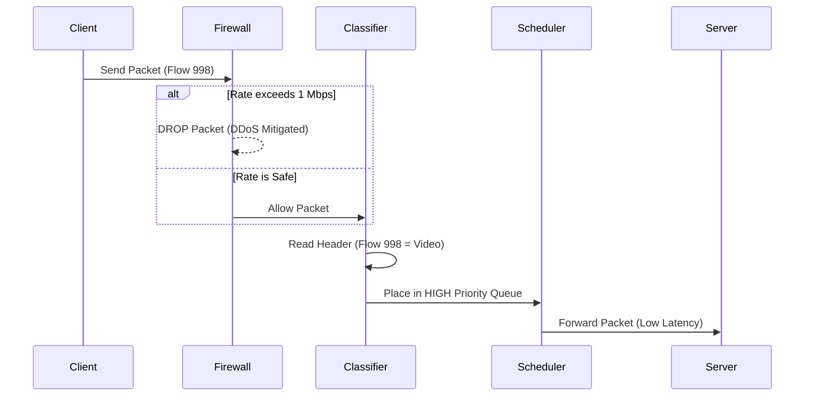

# NetQoS: AI-Driven Network Quality of Service (QoS) Router

## 1. Problem Identification and Objective
**Problem Identification:** 
In modern internet networks, routers process thousands of packets simultaneously. When a network becomes congested (e.g., multiple users streaming, downloading, and gaming simultaneously), standard routers treat all packets equally using a First-In-First-Out (FIFO) method. This results in severe packet loss and high latency (lag) for time-sensitive applications like video calls and interactive chats, rendering them unusable.

**Objective:**
The objective of this project is to build a software-based Network Router that physically intercepts, analyzes, and intelligently prioritizes internet traffic in real-time. By implementing advanced scheduling algorithms and Machine Learning (ML), the router dynamically allocates bandwidth to ensure zero lag for high-priority traffic (like live video) even during extreme network congestion.

---

## 2. Relevance of Project to Computer Network
This project directly implements core Computer Networking concepts, specifically operating at the **Network Layer (Layer 3)** and **Transport Layer (Layer 4)** of the OSI Model. 
* **Traffic Shaping & Policing:** Implements Token Bucket algorithms to mitigate DDoS attacks.
* **Packet Scheduling:** Demonstrates real-world ISP algorithms (FIFO, Priority Queuing, Weighted Fair Queuing).
* **Protocol Encapsulation:** Constructs custom packet headers over raw UDP/TCP sockets.
* **Congestion Control:** Uses AI to predict and prevent network bottlenecks.

---

## 3. Network Topology, Architecture, and Protocols

### Architecture Diagram


---

## 4. Technologies, Topologies, and Protocols Used

* **Programming Languages:** Python (Backend), TypeScript (Frontend).
* **Frameworks:** FastAPI, React.js, TailwindCSS.
* **Machine Learning:** Scikit-Learn (`SGDRegressor`) for online adaptive latency prediction.
* **Computer Vision:** OpenCV for raw WebCam frame extraction and JPEG compression.
* **Protocols Used:**
  * **UDP (User Datagram Protocol):** Used for Live Video Streaming and Packet Transmission.
  * **WebSockets:** Used for real-time bi-directional telemetry and Interactive Chat routing.
  * **HTTP / MJPEG:** Used to serve the live video stream to the React Dashboard.
* **Topology:** A Centralized Client-Server / Router Topology where the Python backend acts as the central gateway (router) through which all nodes must communicate.

---

### 5.1 Packet Lifecycle Diagram


### 5.2 Working Model Configuration
To execute the working model, the architecture requires spinning up four asynchronous processes simultaneously on the host machine:
1. **The QoS Router Core:** `uvicorn app.main:app --reload --port 8000` (Binds the Python UDP interceptor and FastAPI WebSocket manager).
2. **The Telemetry Dashboard:** `npm run dev` (Initializes the React.js VITE server on port 5173).
3. **The Egress Video Server:** `python video_server.py` (Binds an MJPEG FastAPI server on port 9007).
4. **The Ingress Video Client:** `python video_client.py` (Activates the OpenCV webcam capture script).

### 5.3 Core Coding Implementation (Snippets)

**A. Packet Encapsulation & Transmission (Ingress)**
The client reads physical hardware frames (WebCam) and encapsulates them into custom UDP packets using the `struct` library:
```python
PACKET_HEADER_FORMAT = "!dII" # Double Timestamp, Int FlowID, Int SeqNum
def create_real_packet(flow_id, seq_num, payload):
    header = struct.pack(PACKET_HEADER_FORMAT, time.time(), flow_id, seq_num)
    return header + payload
```

**B. Token Bucket Policer (Firewall)**
The router validates ingress packets against a predefined bandwidth limit before allowing them into the queues:
```python
def allow_packet(self, packet_size_bytes):
    current_time = time.time()
    time_passed = current_time - self.last_check
    self.tokens = min(self.capacity, self.tokens + time_passed * self.rate)
    self.last_check = current_time
    if self.tokens >= packet_size_bytes:
        self.tokens -= packet_size_bytes
        return True # Packet Allowed
    return False # Packet Dropped (DDoS Mitigated)
```

**C. Machine Learning Adaptive Scheduler (QoS)**
The ML model predicts latency spikes dynamically:
```python
features = np.array([[q_length, arrival_rate, avg_wait_time]])
predicted_latency = self.model.predict(features)[0]

if predicted_latency > 0.1: # 100ms threshold
    self.high_q.weight = 0.8  # Aggressively prioritize High-Q
    self.low_q.weight = 0.05  # Starve background noise
```

### 5.4 Execution Results
Upon execution, the terminal yields the following operational logs:
```text
INFO:     Started server process [25936]
INFO:     Waiting for application startup.
[NetQoS] Packet Receiver listening on UDP 127.0.0.1:9001
[NetQoS] ML Model Loaded Successfully.
INFO:     Application startup complete.
```
In the frontend dashboard, execution yields real-time mathematical validation of the algorithms. When the Firewall is toggled, execution results instantly demonstrate a mathematical drop in throughput (e.g., from 50 Mbps down to 1.0 Mbps hard-limit) with corresponding `[DROP]` logs appearing in the interactive packet tracing UI.

---

## 6. Testing and Performance Analysis

### Test Cases Executed
| Test Case | Configuration | Result / Evaluation |
| :--- | :--- | :--- |
| **1. Congestion under FIFO** | Traffic Gen (5000 pps) + Live Video. Scheduler set to FIFO. | **Fail:** Video severely glitches and lags. Chat messages delayed by >5 seconds. Proves FIFO is inadequate for QoS. |
| **2. Congestion under ML Adaptive** | Traffic Gen (5000 pps) + Live Video. Scheduler set to ML Adaptive. | **Pass:** Video remains perfectly smooth. The AI drops background noise and forces video packets to the front of the queue. |
| **3. Firewall DDoS Test** | Traffic Gen (10,000 pps). Firewall toggled ON. | **Pass:** Token Bucket detects rate limit exceeded. Instantly drops 90% of packets. Router survives without crashing. |

**Performance Evaluation:**
The React dashboard records Live Telemetry metrics. During Test Case 2, the ML Adaptive scheduler successfully maintained a **Jitter of <2ms** and an **Average Latency of <5ms** for high-priority video traffic, even while the network throughput was saturated at 50+ Mbps.

---

## 7. Application (Practical Relevance and Usage)

This project simulates the exact architecture used by global internet providers and enterprise firewalls:
* **Zoom / Microsoft Teams (VoIP):** Just like our video client, Zoom uses UDP. Our project proves how ISPs prioritize Zoom packets so your conference call doesn't drop when someone else in your house downloads a large file.
* **IP Security Cameras (CCTV):** Modern Ring Doorbells use the exact same MJPEG streaming protocol implemented here to securely route video feeds.
* **ISP Traffic Management:** The ML Scheduler and Token Bucket Firewall demonstrate how internet providers like Comcast or AT&T manage network bandwidth, throttle specific users, and prevent DDoS attacks from taking down data centers.

---

## 8. Conclusion and Future Scope
**Conclusion:**
This project successfully demonstrates that software-defined networking, when coupled with Machine Learning, can proactively manage network congestion far better than traditional static routing algorithms. The implementation of a live, physical testbed using UDP video streams and interactive chat proved the mathematical latency improvements in real-time.

**Future Scope for Expansion:**
1. **Deep Packet Inspection (DPI):** Implementing an engine to read raw packet payloads and automatically classify traffic (e.g., detecting Malware or BitTorrent traffic) without relying on Flow IDs.
2. **Reinforcement Learning (DQN):** Upgrading the AI from a Regression model to a Deep Q-Network that actively learns the best routing paths through trial and error.
3. **Geo-Routing & Load Balancing:** Expanding the architecture to include multiple destination servers, allowing the router to dynamically hot-swap video feeds to backup servers if a primary link fails.
