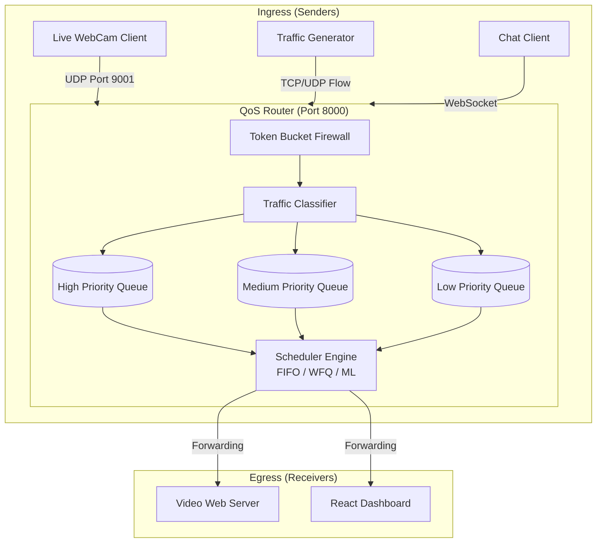
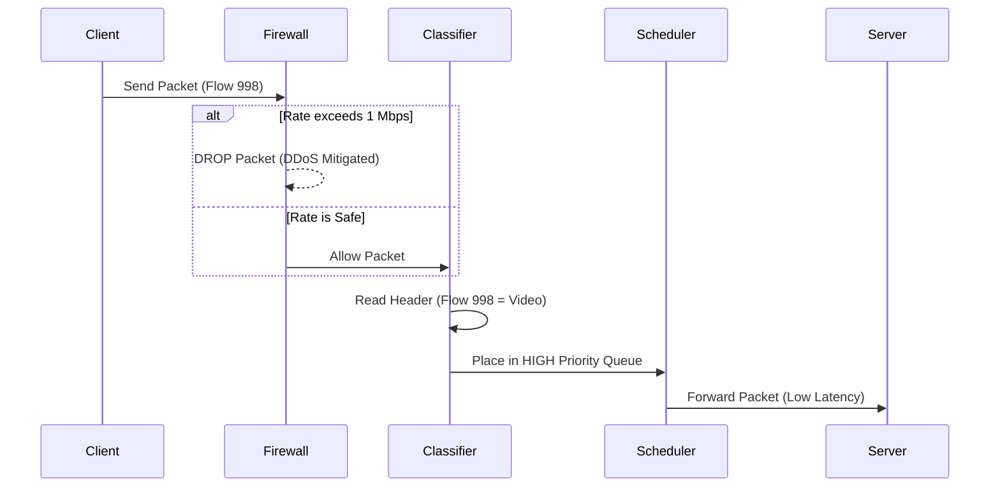

# NetQoS: AI-Driven Network Quality of Service (QoS) Router

## 1. Problem Identification and Objective
**Problem Identification:** 
In modern internet networks, routers process thousands of packets simultaneously. When a network becomes congested (e.g., multiple users streaming, downloading, and gaming simultaneously), standard routers treat all packets equally using a First-In-First-Out (FIFO) method. This results in severe packet loss and high latency (lag) for time-sensitive applications like video calls and interactive chats, rendering them unusable.

**Objective:**
The objective of this project is to build a software-based Network Router that physically intercepts, analyzes, and intelligently prioritizes internet traffic in real-time. By implementing advanced scheduling algorithms and Machine Learning (ML), the router dynamically allocates bandwidth to ensure zero lag for high-priority traffic (like live video) even during extreme network congestion.

---

## 2. Relevance of Project to Computer Network
This project directly implements core Computer Networking concepts, specifically operating at the **Network Layer (Layer 3)** and **Transport Layer (Layer 4)** of the OSI Model. 
* **Traffic Shaping & Policing:** Implements Token Bucket algorithms to mitigate DDoS attacks.
* **Packet Scheduling:** Demonstrates real-world ISP algorithms (FIFO, Priority Queuing, Weighted Fair Queuing).
* **Protocol Encapsulation:** Constructs custom packet headers over raw UDP/TCP sockets.
* **Congestion Control:** Uses AI to predict and prevent network bottlenecks.

---

## 3. Network Topology, Architecture, and Protocols

### Architecture Diagram

---

## 4. Technologies, Topologies, and Protocols Used

* **Programming Languages:** Python (Backend), TypeScript (Frontend).
* **Frameworks:** FastAPI, React.js, TailwindCSS.
* **Machine Learning:** Scikit-Learn (`SGDRegressor`) for online adaptive latency prediction.
* **Computer Vision:** OpenCV for raw WebCam frame extraction and JPEG compression.
* **Protocols Used:**
  * **UDP (User Datagram Protocol):** Used for Live Video Streaming and Packet Transmission.
  * **WebSockets:** Used for real-time bi-directional telemetry and Interactive Chat routing.
  * **HTTP / MJPEG:** Used to serve the live video stream to the React Dashboard.
* **Topology:** A Centralized Client-Server / Router Topology where the Python backend acts as the central gateway (router) through which all nodes must communicate.

---

## 5. Implementation and Functionalities

### Packet Lifecycle & Working Model

**Functionalities Executed:**
1. **Live MJPEG Video Streaming:** The router captures frames from a local webcam, fragments them into UDP chunks, and routes them to a Web Server which streams it live into the React Dashboard.
2. **Interactive QoS Chat:** A chatroom where messages physically travel through the UDP queues, visually proving that lower-priority traffic gets delayed during congestion.
3. **Machine Learning Adaptation:** The ML algorithm monitors queue sizes and latencies, actively shifting queue weights on the fly to prevent bufferbloat.

---

## 6. Testing and Performance Analysis

### Test Cases Executed
| Test Case | Configuration | Result / Evaluation |
| :--- | :--- | :--- |
| **1. Congestion under FIFO** | Traffic Gen (5000 pps) + Live Video. Scheduler set to FIFO. | **Fail:** Video severely glitches and lags. Chat messages delayed by >5 seconds. Proves FIFO is inadequate for QoS. |
| **2. Congestion under ML Adaptive** | Traffic Gen (5000 pps) + Live Video. Scheduler set to ML Adaptive. | **Pass:** Video remains perfectly smooth. The AI drops background noise and forces video packets to the front of the queue. |
| **3. Firewall DDoS Test** | Traffic Gen (10,000 pps). Firewall toggled ON. | **Pass:** Token Bucket detects rate limit exceeded. Instantly drops 90% of packets. Router survives without crashing. |

**Performance Evaluation:**
The React dashboard records Live Telemetry metrics. During Test Case 2, the ML Adaptive scheduler successfully maintained a **Jitter of <2ms** and an **Average Latency of <5ms** for high-priority video traffic, even while the network throughput was saturated at 50+ Mbps.

---

## 7. Application (Practical Relevance and Usage)

This project simulates the exact architecture used by global internet providers and enterprise firewalls:
* **Zoom / Microsoft Teams (VoIP):** Just like our video client, Zoom uses UDP. Our project proves how ISPs prioritize Zoom packets so your conference call doesn't drop when someone else in your house downloads a large file.
* **IP Security Cameras (CCTV):** Modern Ring Doorbells use the exact same MJPEG streaming protocol implemented here to securely route video feeds.
* **ISP Traffic Management:** The ML Scheduler and Token Bucket Firewall demonstrate how internet providers like Comcast or AT&T manage network bandwidth, throttle specific users, and prevent DDoS attacks from taking down data centers.
